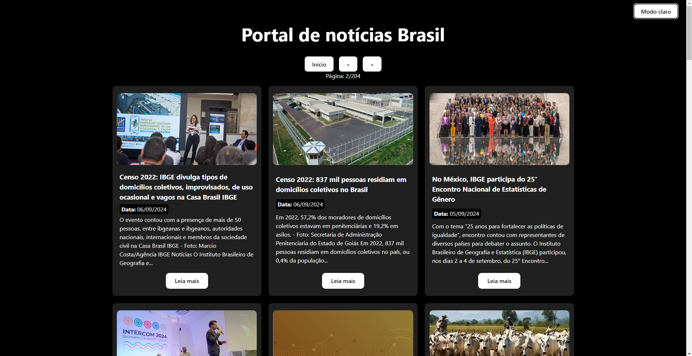
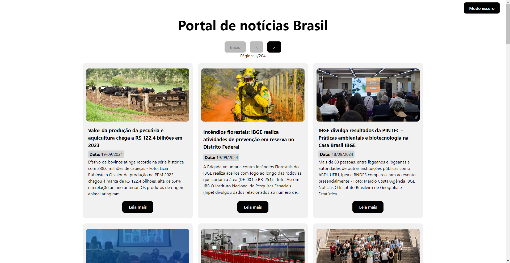
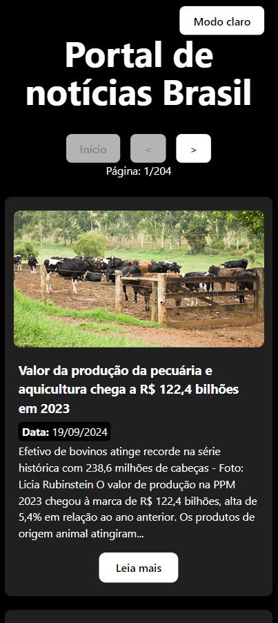

# Projeto Notícias em React com uso da api IBGE

Este projeto é uma aplicação em React que exibe notícias utilizando a API do IBGE. Foi construído para fins de práticas e estudos do ReactJS, a ideia é exibir as noticias e o usuário escolher se deseja visualizar em modo escuro ou claro.

[Acesse o site clicando aqui](https://noticias-app-inky.vercel.app/) ou pelo link: `https://noticias-app-inky.vercel.app/`

## Funcionalidades

- **Carregamento de Notícias**: As notícias são carregadas da API do IBGE.
- **Paginação**: Navegue entre as páginas de notícias.
- **Modo Claro/Escuro**: Alterne entre os temas claro e escuro.
- **Exibição de Detalhes**: Cada notícia exibe título, data de publicação, introdução e um link para ler mais, pois o conteúdo é apenas uma prévia.

## Tecnologias Utilizadas

- CSS
- React
- Hooks (useState, useEffect)
- Fetch API

## Estrutura do Código

A estrutura principal do projeto foi realizada em um único componente, centralizando todas as funcionalidades no arquivo `Noticias.jsx`. Foram utilizados 5 hooks de `useState`, que são descritos a seguir:

```javascript
// Captura as notícias diretamente da API e armazena na variável "news"
const [news, setNews] = useState([]);

// Responsável por atualizar a página, iniciando em 1 (primeira página)
const [page, setPage] = useState(1);

// Captura o total de páginas apenas para exibição
const [totalPages, setTotalPages] = useState(1);

// Exibe o texto "Carregando" quando o usuário estiver com uma internrt lenta
const [loading, setLoading] = useState(false);

// Realiza a mudança de cor da página, alternando entre 'light' e 'dark' na classe
const [cor, setCor] = useState('light');
```

## Capturas de tela do projeto

> - <p>Moto noturno web</p>
>   

<p>

> - <p>Moto claro web</p>
>   

<p>

> - <p>Mobile</p>
>   <div style="display: flex; flex-wrap: wrap; width: 100%; justify-content: space-around"></div>
